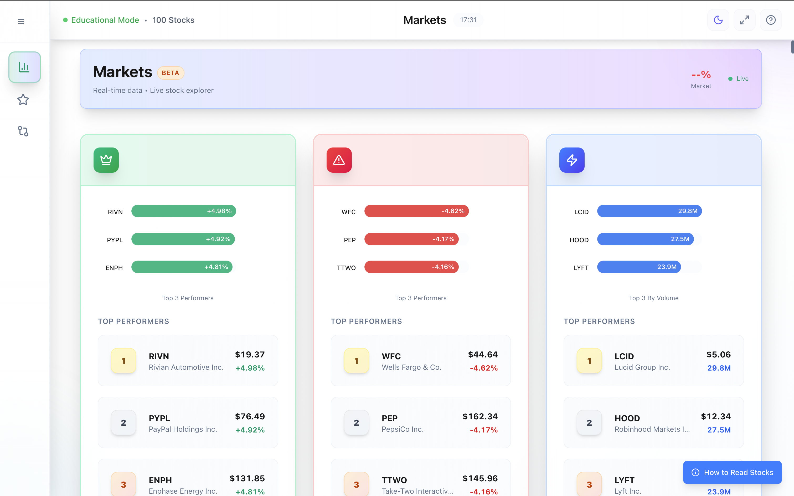
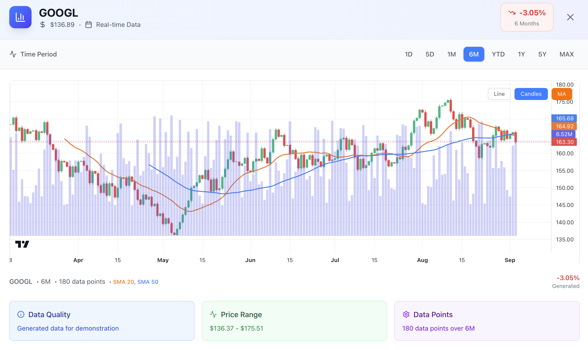
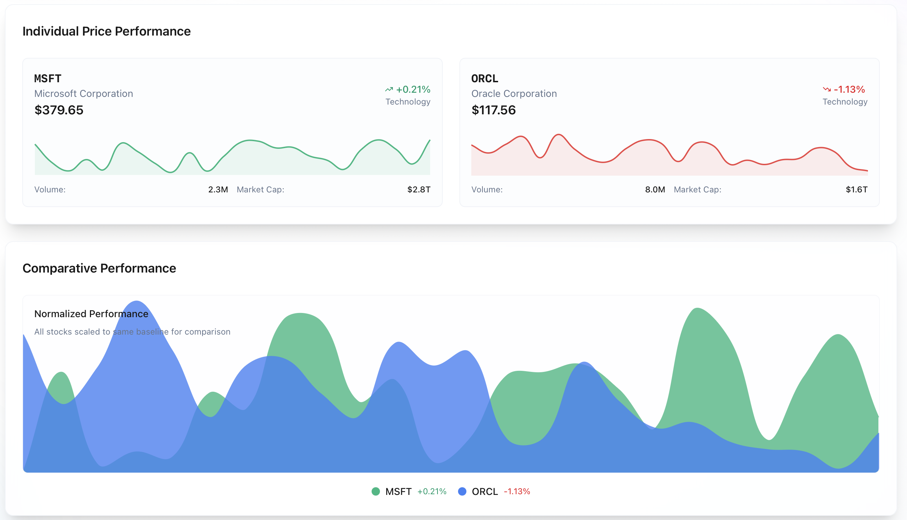
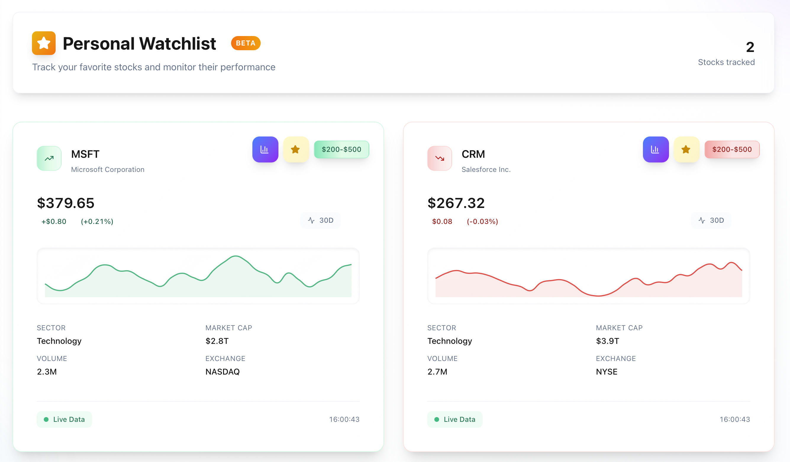
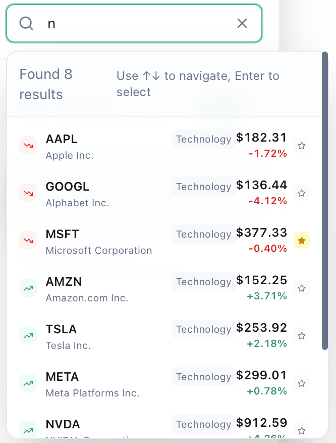

# 📈 Stock Intelligence Platform

<div align="center">
  
**Professional Stock Market Intelligence Platform for Education & Learning**

[](https://stock-intelligence-frontend.vercel.app)
[](LICENSE)
[](https://nextjs.org/)
[](https://www.typescriptlang.org/)

*A Bloomberg-style financial dashboard built for education, learning, and open-source contribution*

</div>

## ✨ Why Stock Intelligence Platform?

🎓 **Educational First**: Designed specifically as a safe learning environment for stock market education  
🚀 **Production Ready**: Professional-grade UI/UX that rivals industry-standard platforms  
💡 **Open Source**: Completely free to use, modify, and extend for your projects  
📱 **Modern Stack**: Built with Next.js 14, TypeScript, and Tailwind CSS  
🎨 **Beautiful Design**: Clean, intuitive interface with dark/light themes  
⚡ **Frontend Only**: No backend required - perfect for learning and prototyping  

---

## 🖥️ Live Demo & Screenshots

**🔗 [Try the Live Demo →](https://stock-intelligence-frontend.vercel.app)**

### Dashboard Overview
*Professional stock market dashboard with real-time feel*





### Stock Comparison Tool
*Compare multiple stocks side-by-side with detailed analytics*



### Watchlist Management
*Personal stock tracking with intuitive management*



### Search
*Search with instant results*



---

## 🚀 Key Features

### 📊 **Professional Trading Interface**
- Bloomberg-style financial dashboard
- Real-time stock cards with performance indicators
- Interactive charts and visualizations
- Professional color coding and animations

### 🔍 **Advanced Search & Filtering**
- Global search across 500+ stocks
- Filter by sector, price range, and performance
- Instant search results with keyboard navigation
- Smart autocomplete and suggestions

### ⭐ **Personal Watchlist**
- Add/remove stocks with one click
- Persistent storage across sessions
- Beautiful watchlist management interface
- Quick access to favorite stocks

### 📱 **Stock Comparison Tool**
- Side-by-side stock analysis
- Performance metrics comparison
- Interactive selection interface
- Detailed comparison charts

### 🎨 **Modern User Experience**
- Clean, professional design language
- Smooth animations and transitions
- Dark/Light theme support
- Fully responsive design
- Touch-friendly mobile interface

### 💾 **Frontend-Only Architecture**
- No backend required
- Perfect for learning and prototyping
- Easy deployment to any hosting platform
- Mock data for educational purposes

---

## 🛠️ Technology Stack

<div align="center">

| Technology | Purpose | Why We Chose It |
|------------|---------|----------------|
| **Next.js 14** | React Framework | Server-side rendering, optimal performance |
| **TypeScript** | Type Safety | Better development experience, fewer bugs |
| **Tailwind CSS** | Styling | Rapid UI development, consistent design |
| **Lucide React** | Icons | Beautiful, consistent icon library |
| **React Context** | State Management | Simple, effective state management |
| **Local Storage** | Data Persistence | Client-side data storage |

</div>

---

## ⚡ Quick Start

### 1. **Clone & Install**

```bash
# Clone the repository
git clone https://github.com/yourusername/stock-intelligence-frontend.git
cd stock-intelligence-frontend

# Install dependencies
npm install
# or
yarn install
```

### 2. **Environment Setup (Optional)**

```bash
# Copy environment template
cp .env.local.example .env.local

# Edit with your preferences
NEXT_PUBLIC_APP_NAME="Stock Intelligence"
NEXT_PUBLIC_APP_VERSION="1.0.0"
```

### 3. **Start Development**

```bash
# Start development server
npm run dev
# or 
yarn dev

# Open http://localhost:3000
```

### 4. **Build for Production**

```bash
# Build optimized production version
npm run build
npm run start

# Or export static files
npm run build && npm run export
```

---

## 📁 Project Structure

```
stock-intelligence-frontend/
├── 📁 src/
│   ├── 📁 app/                    # Next.js App Router
│   │   ├── layout.tsx            # Root layout
│   │   └── page.tsx              # Home page
│   ├── 📁 components/            
│   │   ├── 📁 charts/           # Chart components
│   │   ├── 📁 layout/           # Layout components
│   │   ├── 📁 markets/          # Market-related components
│   │   ├── 📁 navigation/       # Navigation components
│   │   ├── 📁 search/           # Search functionality
│   │   └── 📁 ui/               # Reusable UI components
│   ├── 📁 contexts/             # React Context providers
│   ├── 📁 hooks/                # Custom React hooks
│   ├── 📁 lib/                  # Utilities and helpers
│   ├── 📁 services/             # API services (mock data)
│   └── 📁 types/                # TypeScript definitions
├── 📁 public/                   # Static assets
├── 📁 docs/                     # Documentation and screenshots
└── 📋 Configuration files
```

---

## 🎯 Use Cases & Applications

### 🎓 **Educational Institutions**
- Teaching stock market fundamentals
- Interactive finance courses
- Student portfolio projects
- Market analysis workshops

### 👨‍💻 **Developers**
- Learn modern React patterns
- Practice TypeScript development
- Study component architecture
- Build portfolio projects

### 🏢 **Businesses**
- Prototype financial applications
- Internal training tools
- Client demonstration platforms
- Proof-of-concept projects

### 🌟 **Personal Projects**
- Learning investment concepts
- Building custom dashboards
- Experimenting with financial data
- Creating educational content

---

## 🎨 Customization Guide

### **Theme Customization**

```typescript
// tailwind.config.js
module.exports = {
  theme: {
    extend: {
      colors: {
        // Custom brand colors
        brand: {
          primary: '#10b981',
          secondary: '#3b82f6',
        }
      }
    }
  }
}
```

### **Adding New Features**

```typescript
// Example: Adding a new stock metric
interface Stock {
  symbol: string;
  company_name: string;
  current_price: number;
  change_percent: number;
  // Add your custom fields
  customMetric?: number;
}
```

### **API Integration**

```typescript
// lib/api.ts - Replace mock data with real APIs
export const getAllStocks = async (): Promise<Stock[]> => {
  // Replace with your API endpoint
  return fetch('/api/stocks').then(res => res.json());
};
```

---

## 🚀 Deployment Options

### **Vercel (Recommended)**
```bash
npm install -g vercel
vercel --prod
```

### **Netlify**
```bash
npm run build
# Upload `out` folder to Netlify
```

### **GitHub Pages**
```bash
npm run build
npm run export
# Deploy `out` folder to GitHub Pages
```

### **Docker**
```bash
docker build -t stock-intelligence .
docker run -p 3000:3000 stock-intelligence
```

---

## 🤝 Contributing

We welcome contributions from developers of all skill levels! 

### **Ways to Contribute**

- 🐛 **Report bugs** - Help us identify issues
- 💡 **Suggest features** - Share your ideas
- 📖 **Improve documentation** - Help others learn
- 🔧 **Submit code** - Fix bugs or add features
- 🎨 **Design improvements** - Enhance the UI/UX

### **Getting Started**

1. **Fork** the repository
2. **Clone** your fork: `git clone https://github.com/yourusername/stock-intelligence-frontend.git`
3. **Create branch**: `git checkout -b feature/amazing-feature`
4. **Make changes** and **test thoroughly**
5. **Commit**: `git commit -m 'Add amazing feature'`
6. **Push**: `git push origin feature/amazing-feature`
7. **Create Pull Request**

### **Development Guidelines**

- ✅ Use TypeScript for all new code
- ✅ Follow existing code patterns
- ✅ Add tests for new functionality
- ✅ Update documentation
- ✅ Ensure responsive design
- ✅ Test across different browsers

---

## 📊 Performance & Analytics

- ⚡ **Lighthouse Score**: 95+ Performance
- 📱 **Mobile Friendly**: 100% responsive design
- 🎨 **Core Web Vitals**: Optimized loading and interaction
- 🚀 **Bundle Size**: < 500KB gzipped
- ♿ **Accessibility**: WCAG 2.1 AA compliant

---

## 💬 Community & Support

### **Get Help**
- 📚 [Documentation](docs/)
- ❓ [GitHub Issues](https://github.com/yourusername/stock-intelligence-frontend/issues)
- 💬 [Discussions](https://github.com/yourusername/stock-intelligence-frontend/discussions)

### **Stay Connected**
- ⭐ **Star this repo** if you find it useful
- 👀 **Watch** for updates and new features
- 🐦 **Follow** for project updates

---

## 📄 License

This project is **open source** and available under the [MIT License](LICENSE).

```
MIT License - feel free to use this project for:
✅ Personal projects
✅ Commercial applications  
✅ Educational purposes
✅ Modification and redistribution
```

---

## 🙏 Acknowledgments

- **Design Inspiration**: Bloomberg Terminal, Yahoo Finance
- **Icons**: [Lucide React](https://lucide.dev/)
- **UI Components**: Custom built with Tailwind CSS
- **Data**: Educational mock data for learning purposes

---

<div align="center">

**Built with ❤️ for the open source community**

[](https://github.com/yourusername/stock-intelligence-frontend/stargazers)
[](https://github.com/yourusername/stock-intelligence-frontend/network/members)

[Live Demo](https://stock-intelligence-frontend.vercel.app) • [Report Bug](https://github.com/yourusername/stock-intelligence-frontend/issues) • [Request Feature](https://github.com/yourusername/stock-intelligence-frontend/issues)

</div>